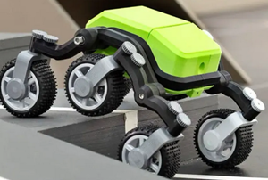

# WNCC NASA NeSpaceGrant.org Projects

- These projects are supported by the [NASA Nebraska Space Grant](https://www.nespacegrant.org)
- This is the repository for Western Nebraska Community College NASA Nebraska Space Grant Student Fellowships and NASA projects.
- Enhancing Computer Science Curriculum using off-the-shelf Robotics Kits to Increase Whole Brain Learning. This is part of an ongoing project by Bill Loring (Mentor). Thor and Tyr the Mars Stair Climbing Rover are part of this project.

# Current Projects

## Sp25 Tyr the Mars Rover

In Norse mythology, the Scandinavian god most closely associated with Mars, the Roman god of war, is Týr (pronounced "teer").

Týr is primarily depicted as a god of justice, courage, and war, which aligns with Mars's characteristics, and the name "Tuesday" in English is derived from "Týr's day." Considered a brave and just warrior, often associated with upholding oaths and agreements.

### Famous Myth

In Norse stories, Týr famously lost his hand while trying to bind the monstrous wolf Fenrir.

### Connection to Mars

The "interpretatio romana" (Roman interpretation) of Norse gods often linked Týr with Mars.

Take a look at the project in the [Tyr](/Tyr) folder.

[WNCC NASA YouTube Playlist](https://www.youtube.com/playlist?list=PLR6oEuLJnHfhdkXqSacJznSHjEgodiWIl)

## 2021-25 Thor the Robot Arm

Thor is a robotic arm project which has been underway for several years.

The original project: [Thor](http://thor.angel-lm.com) - An Open Source 3D Printable 6DOF Robotic Arm.

### Code

- [Thor Aasgard GUI](https://github.com/itinstructor/Asgard) (Forked from AngelLM)
- [Thor GamePad Control](https://github.com/mike0618/thor_gamepad_control) (Mike Zubko)

### History

- **12/22/2025** - Thor GamePad control programmed and tested.
- **12/01/2024** - Thor is assembled and functional.

# Archived Projects

## 2024-25 NASA Fellowships Mars Rover Simulations

This project simulates navigating, gathering, and transmitting information from Mars to Earth using Raspberry Pi-based [GoPiGo3](https://gopigo.io)'s.

### Jessica

- Sensors, remote control.

## Astronomy Photos by Tom Robinson

Tom Robinson, astronomy instructor at WNCC, made these photos available to us for use as Unity Assets.

## NASA Fellowships 23-24 Virtual Reality Simulations with Unity

- Oculus Quest 2 VR headsets.
- Learning how to use Unity to create VR projects.

## Project Video Recordings

- **09/07/2023** - [Gus playing golf](https://www.facebook.com/wnccitprogram)
- **09/07/2023** - [Tour of Isaac's Room](https://youtu.be/DU64BSgh7Vk)
- **12/30/2023** - [Tour of Gus' Project](https://youtu.be/7ac5SFJFNlk)
- **04/18/2024** - [Final Tour of Gus' Project](https://youtu.be/XbGXymeqCyg)
- **04/26/2024** - [Final Tour of Isaac's Project](https://youtu.be/DVnvoxbtGCI)

## How to Import Blender Images to Unity

[Blender Images to Unity](https://www.youtube.com/watch?v=yloupOUjMOA)

## Analog Meets Digital

We are working on 3D printing projects to be painted with acrylic paints. This is in cooperation with the Art program.

## Purpose

Bill Loring (Mentor): I am an Information Technology Instructor at Western Nebraska Community College. I teach Information Technology Technical Support, CyberSecurity, and Computer Science.

Visit my GitHub repository for my own [GoPiGo3](https://github.com/itinstructor/GoPiGo3) and Raspberry Pi projects.

- Facebook: [Facebook WNCC IT Program](https://www.facebook.com/wnccitprogram/)
- YouTube: [YouTube WNCC IT Program](https://www.youtube.com/@wnccitprogram)

### License

  
This work is licensed under a [Creative Commons Attribution-NonCommercial-ShareAlike 4.0 International License](http://creativecommons.org/licenses/by-nc-sa/4.0/).

