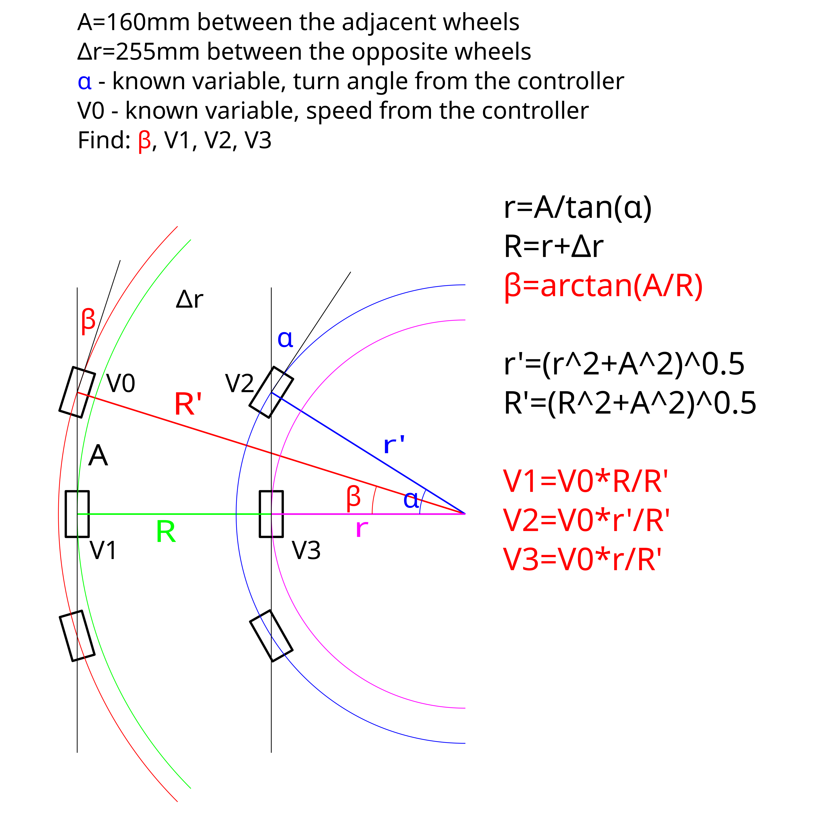

# Tyr project

## "Car mode" turn calculations

## Raspberry Pi 5 and PS4 Joystick

- [Main control program](tyr_controller.py)
- Auto start services are in: *~/.config/systemd/user/*
  - btcont.service enabled by using: *systemctl --user enable btcont*
  - tyr.service enabled by using: *systemctl --user enable tyr*

## Motor2040 Quad Motor Controllers

2 - [Motor2040 - Quad Motor Controllers](https://shop.pimoroni.com/products/motor-2040?variant=39884997853267)

- We chose the Motor2040 as each controller supports 4 motors
  - Control the left and right side with separate motor controllers.
  - This controller offers PWM and PID support and is programmed in CircuitPython.

## Step by Step Setup for Motor2040 Quad Motor Controllers

- Setup CircuitPython on the Motor2040 Quad Motor Controllers

### Installing CircuitPython on Motor2040

**NOTE:** If you are upgrading CircuitPython, backup your code.py file for each controller.

1. **Download CircuitPython UF2 file**
   - Go to [CircuitPython.org downloads](https://circuitpython.org/board/pimoroni_motor2040/)
   - Download the latest stable `.uf2` file for Motor2040

2. **Put Motor2040 into bootloader mode**
   - Connect the Motor2040 to your computer via USB-C cable
   - Hold down the **BOOT** button on the Motor2040
   - While holding BOOT, press and release the **RESET** button
   - Release the **BOOT** button
   - The board should appear as a USB drive named **RPI-RP2**

3. **Install CircuitPython**
   - Copy the downloaded `.uf2` file to the **RPI-RP2** drive
   - The board will automatically reboot
   - After reboot, it should appear as a drive named **CIRCUITPY**

4. **Verify installation**
   - You should see a **CIRCUITPY** drive with files like:
     - `boot_out.txt`
     - `code.py` (may be empty initially)
     - `lib/` folder

5. **Install required libraries**
   - Download the [CircuitPython Library Bundle](https://circuitpython.org/libraries)
   - Extract and copy these libraries to the `lib/` folder on **CIRCUITPY**:
     - `adafruit_motor/`
     - `adafruit_pca9685.mpy`
     - Any other libraries your code requires

6. **Upload your code**
   - Copy your main program as `code.py` to the **CIRCUITPY** drive
   - The board will automatically restart and run your code

7. **Troubleshooting**
   - If the board doesn't appear as **RPI-RP2**, try a different USB cable
   - Make sure you're holding BOOT before pressing RESET
   - Some computers may require drivers for the RP2040 chip

**Note:** Repeat this process for both Motor2040 controllers (left and right side motors).

## Controls

- Left stick Right/Left to make turn (*in Two sticks mode*)
- Right stick Up/Down to move Forward/Backward
- Right stick Right/Left to make turn (*in One stick mode*)
- X button to switch between Car/Parallel modes
- O button to switch the Rover mode on/off
- Δ button to switch between One/Two sticks control

## Importing Code

- Importing old controller code to Pi
  - To use as a reference when developing changes
